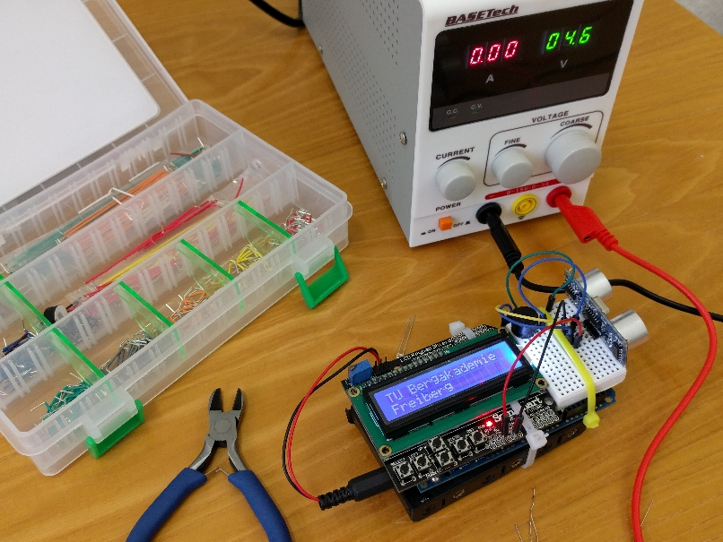
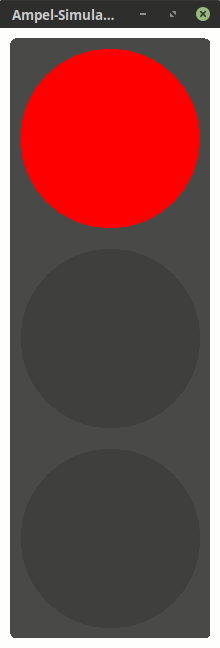

<!--

author:   Sebastian Zug & André Dietrich
email:    zug@ovgu.de   & andre.dietrich@ovgu.de
version:  0.0.1
language: de
narrator: Deutsch Female

import: https://raw.githubusercontent.com/liaTemplates/logicemu/master/README.md
import: https://raw.githubusercontent.com/liaScript/rextester_template/master/README.md
-->

# Vortrag "Anwendung und Realisierung von boolschen Funktionen"

**Samuel-von-Pufendorf-Gymnasiums, 1. Februar 2019**

Prof. Dr. Sebastian Zug, Technische Universität Bergakademie Freiberg

------------------------------

<!-- width="80%" -->

Code des Vortrages https://github.com/SebastianZug/StateMachines
Präsentationsmodus [Link](https://liascript.github.io/course/?https://raw.githubusercontent.com/SebastianZug/StateMachines/master/README.md#1)

## 1. Einführung

Studium der Angewandten Informatik an der Technischen Bergakademie Freiberg

https://tu-freiberg.de/fakult1/inf

<!-- width="80%" -->

*"Hacken kann jeder, da brauche ich kein \[Informatik-\] Studium"* \[Forenbeitrag\]

## 2. Motivation des Beispiels

Wieviel Informatik steckt in einer Verkehrsampel?

<!-- width="80%" -->

Zielstellung: Koordination des Verkehrsflusses

Technische Herausforderungen:
* Vernetzung und Koordination der Ampeln selbst,
* Adaption des Verhaltens
* Interaktion mit den Verkehrsteilnehmern

**Wir wollen eine einzige Ampel mit einer Softwarelösung und einer Hardwarelösung umsetzen!**

### Analyse des Systems

Unsere Herausforderung heute ... Implementierung einer einzelnen
Ampelanlage.

<!-- width="10%" --> [^1]

[^1]:https://wiki.byte-welt.net/wiki/Simulation_einer_Verkehrsampel

Wie würden Sie den Ablauf beschreiben?

+ 4 Phasen - Rot, Rot-Gelb, Grün, Gelb
+ Bestimmte Zeitintervalle dazwischen

<!--
style="width: 80%; max-width: 460px; display: block; margin-left: auto; margin-right: auto;"
-->
````ascii
                   0       1        2       3       Zustand

                  .-.     .-.      .-.      .-.
  Rot            ( X )   ( X )    (   )    (   )
                  '-'     '-'      '-'      '-'

                  .-.     .-.      .-.      .-.
  Gelb           (   )   ( X )    (   )    ( X )
                  '-'     '-'      '-'      '-'

                  .-.     .-.      .-.      .-.
  Grün           (   )   (   )    ( X )    (   )
                  '-'     '-'      '-'      '-'

             .-> 100s ---> 2s ---> 100s ---> 2s -.
             |                                   |
             .-----------------------------------.
````

### Zielstellung

<!--
style="width: 70%; max-width: 460px; display: block; margin-left: auto; margin-right: auto;"
-->
```ascii
 EINGABEN                                  AUSGABEN

 Taktgeber            ╔═══════════╗
 ┴┴┴┴┴┴┴┴┴┴    2S  -->║           ║
 ┴───...──┴  100S  -->║   Ampel-  ║
                      ║           ║───┬──> Rot
                 .--->║           ║──┬┼──> Gelb
                 |.-->║ steuerung ║─┬┼┼──> Grün
                 ||.->║           ║ │││
                 |||  ╚═══════════╝ │││
                 ||'----------------╯││
                 |'------------------╯│
                 '--------------------╯
````

Wie entwerfen wir eine Abstraktion, die diese Zusammenhänge abbildet und auf
verschiedenen Hardwareebenen realisierbar ist?


## 3. Entwurf des Automaten

**Einführungsbeispiel**

Ein endlicher Automat (auch Zustandsmaschine, Zustandsautomat) ist ein Modell
eines Verhaltens, bestehend aus Zuständen, Zustandsübergängen und Aktionen.

Eine Tür lässt sich zum Beispiel mit zwei Zuständen beschreiben "auf" und "zu"

Bespiel:

<!--
style="width: 100%; max-width: 460px; display: block; margin-left: auto; margin-right: auto;"
-->
```ascii
                  Zustandsübergang (Transition)

                  .--------- schließen ----------.
                  |                              |
                  |                              v
                 .-.                            .-.
 Zustände       (auf)                          (zu )
                 '-'                            '-'
                  ^                              |
                  |                              |
                  .----------- öffnen -----------.
```

{{1-4}} Der Übergang lässt sich dabei mit einer *Zustandsübergangstabelle* darstellen.

{{1-4}}
| Eingabe $E$   | alter Zustand $Z$ | neuer Zustand $Z'$ |
|:-----------|:--------------|:--------------|
| öffnen     | offen         | offen         |
| öffnen     | zu            | offen         |
| schließen  | offen         | zu            |
| schließen  | zu            | zu            |

{{2-4}} Ausgehend vom Zustand soll nun noch eine Ausgabe erfolgen, zum Beispiel
ein Warnlicht aktiviert werden

{{2-4}}
| Zustand $Z$ | Ausgabe   $A$   |
|:------------|:----------------|
| offen       | Warnlicht       |
| zu          | Warnlicht aus   |

{{3-4}}
> Zusammenfassung: Ein endlicher Automat bildet Eingabegrößen $E$ auf Zustände $Z$
> und Ausgabegrößen $A$ ab.

### ... angewandt auf die Ampel
<!--
style="width: 80%; max-width: 460px; display: block; margin-left: auto; margin-right: auto;"
-->
```ascii
                  .- 100s -. .-- 2s --. .- 100s -.
                  |        | |        | |        |
                  |        v |        v |        v
                 .-.       .-.        .-.       .-.
 Ampelzustände  ( 0 )     ( 1 )      ( 2 )     ( 3 )
                 '-'       '-'        '-'       '-'
                  ^                              |
                  |                              |
                  .------------- 2s -------------.
```
Wie verhält sich unser System für verschiedenen Kombinationen der Variablen 2s und 100s?

{{0-1}} Eingaben $E$

{{0-1}}
* `2s` ... ein Timer generiert kurzzeitig eine  "1", wenn ein 2 Sekundenintervall abgelaufen ist, dazwischen hat der Eingang den Wert "0"
* `100s` ... ein 100-Sekundentimer generiert einen Wert "1"

{{1-2}}
| 2s  | 100s  |  Zustand  | Zustand neu |
|:----|:------|:----------|:---------|
|  0  |  0    |    0      |   0      |
|  0  |  0    |    1      |   1      |
|  0  |  0    |    2      |   2      |
|  0  |  0    |    3      |   3      |

{{2-3}}
| 2s  | 100s |  Zustand  | Zustand' |
|:----|:------|:----------|:---------|
| <span style="color:red"> 0 </span> |  <span style="color:red"> 1 </span>     |    <span style="color:red"> 0 </span>       |  <span style="color:red"> 1 </span>      |
|  0  |  1    |    1      |   1      |
| <span style="color:red"> 0 </span> |  <span style="color:red"> 1 </span>     |    <span style="color:red"> 2 </span>       |  <span style="color:red"> 3 </span>      |
|  0  |  1    |    3      |   3      |

{{3-4}}
| 2s  | 100s |  Zustand  | Zustand' |
|:----|:------|:----------|:---------|
|  1  |  0    |    0      |   0      |
| <span style="color:red"> 1</span> |  <span style="color:red"> 0 </span>     |    <span style="color:red"> 1 </span>       |  <span style="color:red"> 2 </span>      |
|  1  |  0    |    2      |   2      |
| <span style="color:red"> 1</span> |  <span style="color:red"> 0 </span>     |    <span style="color:red"> 3 </span>       |  <span style="color:red"> 0 </span>      |

{{4-5}}
Die Kombination `2_s = 1` und `100s = 1` bleibt hier unbeachtet.

### Jetzt wird es digital

> Für die Repräsentation der Zustände nutzen wir digitale Speicher - **Flip-Flops**.
> Folglich müssen unsere Zustande auch mit `0` und `1` codiert werden.

Abbildung der Zustände durch einen binären Speicher, sogen. Flip-Flops (FF), wobei ein
einzelner Flip-Flop ein Bit, also zwei unterschiedliche Zustände speichern
kann.

```D-FlipFlop.asci
"Input"   s----->d----->l
                 #
"Clock"   p----->c
```
@LogicEmu.eval

Wie viele Flip-Flops brauchen wir für unsere Ampel?

{{1-3}}
<!--
style="width: 80%; max-width: 460px; display: block; margin-left: auto; margin-right: auto;"
-->
```ascii
                  .- 100s -. .-- 2s --. .- 100s -.
                  |        | |        | |        |
                  |        v |        v |        v
                 .-.       .-.        .-.       .-.
 Ampelzustände  ( 0 )     ( 1 )      ( 2 )     ( 3 )
                 '-'\     /'-'        '-'\     /'-'
                  ^   FF1                  FF2   |
                  |                              |
                  .------------- 2s -------------.
```

{{2-3}}
| Ampelphase | Zustand | FF2      | FF1     |
|:-----------|:--------|:---------|:--------|
| Rot        |  0      |   0      |   0     |
| Rot-Gelb   |  1      |   0      |   1     |
| Grün       |  2      |   1      |   0     |
| Gelb       |  3      |   1      |   1     |

### Ableitung der Gleichungen

Soweit so gut, aber wie können wir ein System entwerfen, dass
* zwischen diesen Zuständen entsprechend den Eingaben wechselt
* die Ausgaben generiert

Noch mal die Idee ...

<!--
style="width: 70%; max-width: 460px; display: block; margin-left: auto; margin-right: auto;"
-->
```ascii
 EINGABEN E              CLOCK C           AUSGABEN A
                            v
 Taktgeber            ╔═══════════╗
 ┴┴┴┴┴┴┴┴┴┴    2S  -->║           ║──────> Rot
 ┴───...──┴  100S  -->║   Ampel-  ║──────> Gelb
                      ║           ║──────> Grün
                  .-->║   Logik   ║--╮ FF1
                  |.->║           ║-╮│ FF2
                  ||  ╚═══════════╝ ││
  ZUSTAND' Z'     |'----------------╯│
                  '------------------╯
```
$$A = f(Z)$$
$$Z' = Z + E$$


{{1-3}}
** Schritt 1 - Ausgabefunktionen A**

{{1-3}}
| Zustand | FF2      | FF1     |  A_Rot  | A_Gelb   | A_Grün  |
|:--------|:---------|:--------|:--------|:---------|:--------|
|  0      |   0      |   0     |  1      |   0      |   0     |
|  1      |   0      |   1     |  1      |   1      |   0     |
|  2      |   1      |   0     |  0      |   0      |   1     |
|  3      |   1      |   1     |  0      |   1      |   0     |

{{2-3}}
$$A_{Rot} = (\overline{FF_2} \cdot \overline{FF_1}) + (\overline{FF_2} \cdot FF_1) = \overline{FF_2}$$
$$A_{Gelb} = (\overline{FF_2} \cdot FF_1) + (FF_2 \cdot FF_1) = FF_1$$
$$A_{Grün} = FF_2 \cdot \overline{FF_1}$$

{{3-6}}
** Schritt 2 - Zustandsübergangsfunktion Z**

{{3-4}}
| 2_s | 100_s | Z |Z'  |
| 0   | 0     | 0 | 0  |
| 0   | 0     | 1 | 1  |
| 0   | 0     | 2 | 2  |
| 0   | 0     | 3 | 3  |
| 0   | 1     | 0 | 1  |
| 0   | 1     | 1 | 1  |
| 0   | 1     | 2 | 3  |
| 0   | 1     | 3 | 3  |
| 1   | 0     | 0 | 0  |
| 1   | 0     | 1 | 2  |
| 1   | 0     | 2 | 2  |
| 1   | 0     | 3 | 0  |


{{4-6}}
| 2_s | 100_s | Z | Z' | FF2 | FF1 | FF2' | FF1' |
| 0   | 0     | 0 | 0  | 0   | 0   | 0    | 0    |
| 0   | 0     | 1 | 1  | 0   | 1   | 0    | 1    |
| 0   | 0     | 2 | 2  | 1   | 0   | 1    | 0    |
| 0   | 0     | 3 | 3  | 1   | 1   | 1    | 1    |
| 0   | 1     | 0 | 1  | 0   | 0   | 0    | 1    |
| 0   | 1     | 1 | 1  | 0   | 1   | 0    | 1    |
| 0   | 1     | 2 | 3  | 1   | 0   | 1    | 1    |
| 0   | 1     | 3 | 3  | 1   | 1   | 1    | 1    |
| 1   | 0     | 0 | 0  | 0   | 0   | 0    | 0    |
| 1   | 0     | 1 | 2  | 0   | 1   | 1    | 0    |
| 1   | 0     | 2 | 2  | 1   | 0   | 1    | 0    |
| 1   | 0     | 3 | 0  | 1   | 1   | 0    | 0    |

{{5-6}}
Wie kann man diese Wertetabellen minimieren?

{{5-6}}
```python       solveBoolFunc.py
from sympy.logic import SOPform
from sympy import symbols
from sympy import printing

x3, x2, x1, x0 = symbols('2s 100s FF2 FF1')

FF1_minterms = [[0, 0, 0, 1],
                [0, 0, 1, 1],
                [0, 1, 0, 0],
                [0, 1, 0, 1],
                [0, 1, 1, 0],
                [0, 1, 1, 1],]
result = SOPform([x3, x2, x1, x0], FF1_minterms)
print "FF1 = " + (printing.ccode(result))

FF2_minterms = [[0, 0, 1, 0],
                [0, 0, 1, 1],
                [0, 1, 1, 0],
                [0, 1, 1, 1],
                [1, 0, 0, 1],
                [1, 0, 1, 0],]
result = SOPform([x3, x2, x1, x0], FF2_minterms)
print "FF2 = " + (printing.ccode(result))
```
@Rextester.eval(@Python,true)

{{5-6}}
$$FF_1 =(FF_1 \cdot \overline{2s}) + (\overline{2s} \cdot 100s)$$
$$FF_2 =(FF_2 \cdot \overline{2s}) + (\overline{100s} \cdot FF_2 \cdot \overline{FF_1}) + (2s \cdot \overline{100s} \cdot FF_1 \cdot \overline{FF_2})$$

## 4. Realsierung

Eine der großen Herausforderungen in jedem Projekt ist die Wahl der geeigneten Umsetzungsebene. Welche Formate bieten sich für unser Projekt an?

| Methode           | Bauteilkosten    | Entwurf        | Variabilität   |
|:------------------|:-----------------|:---------------|:---------------|
| Analoge Schaltung | minimal          | aufwändig      | gering         |
| Digitale Logik    | gering           | einfach        | mittel         |
| Software (eingebetteter $\mu$C) | überschaubar | einfach | hoch         |
| Software (PC)     | hoch        | sehr einfach | hoch   |

### ... mit ICs (zumindest in der Simulation)

$$A_{Rot} = \overline{FF_2}; A_{Gelb} = FF_1; A_{Grün} = FF_2 \cdot \overline{FF_1}$$
$$FF_1 =(FF_1 \cdot \overline{2s}) + (\overline{2s} \cdot 100s)$$
$$FF_2 =(FF_2 \cdot \overline{2s}) + (\overline{100s} \cdot FF_2 \cdot \overline{FF_1}) + (2s \cdot \overline{100s} \cdot FF_1 \cdot \overline{FF_2})$$

Warum brauchen wir einen Takt?

```-ampel.asci
"2s 100s"          p"Clock"
  s s              *
  * *   *----------+----*  *-->O-->l0
  *-+-+-+-]a---->o-+->d-*--+-*---->l2
  * * * *-># *--># *  #    * *>O>a>l3
  * * * *    *     **>c    *     ^
  *-+-+-+-]a-*     *"FF1"  *-----*
  * *-+-+->#       *       *
  * * * *          *       *
  * * * *          *"FF2"  *
  *-+-+-+-]a---->o-+->d-*--*
  * * *-+-># *--># *  # *
  * * * *    * *># **>c *
  * *-+-+-]a-* *        *
  * * *-+->#   *        *
  * * * *-]#   *        *
  * * * *      *        *
  *-+-+-+->a---*        *
    *-+-+-]#            *
      *-+-]#            *
      * *->#            *
      *-----------------*
```
@LogicEmu.eval

### ... in Software

Implementierung in C für einen Arduino Uno (Atmega 328 Controller)

```cpp
typedef struct {
    int state;
    int next;
    int A_red;
    int A_yellow;
    int A_green;
    int timer;
} ampel_state_t;

ampel_state_t state_table[4] = {

// state     A_red             timer
//  |   next  |  A_yellow       |
//  |    |    |   |    A_green  |
//----------------------------------------------
{   0,   1,   1,  0,    0,      10},
{   1,   2,   1,  1,    0,      2 },
{   2,   3,   0,  0,    1,      10},
{   3,   0,   0,  1,    0,      2,}
};

const int greenPin = A0;
const int yellowPin = 11;
const int redPin = 13;
int state = 0;

void setup() {
  pinMode(greenPin, OUTPUT);
  pinMode(yellowPin, OUTPUT);
  pinMode(redPin, OUTPUT);
}

void loop() {
  if (state_table[state].A_red == 1) digitalWrite(redPin, HIGH);
  else digitalWrite(redPin, LOW);
  if (state_table[state].A_yellow == 1) digitalWrite(yellowPin, HIGH);
  else digitalWrite(yellowPin, LOW);
  if (state_table[state].A_green == 1) digitalWrite(greenPin, HIGH);
  else digitalWrite(greenPin, LOW);
  delay(state_table[state].timer*1000);
  state =  state_table[state].next;
}
```

## 5. Zusammenfassung und Ausblick

__Ablauf beim Aufstellen eines Automaten__

1. Analyse des Systems, Identifikation von Eingängen, Ausgängen und Zuständen
2. Modellierung als Automat
3. Aufstellen der Wahrheitstafel
4. Ableiten der Schaltfunktionen
5. Realisieren in Hardware oder Software

__Mängel oder Fragen hinsichtlich unserer Lösung__
* Keine Berücksichtigung von gleichzeitig aktivem 2s und 100s
* Wie setzen wir die Timer um?

Vielen Dank für Ihr Interesse ...
